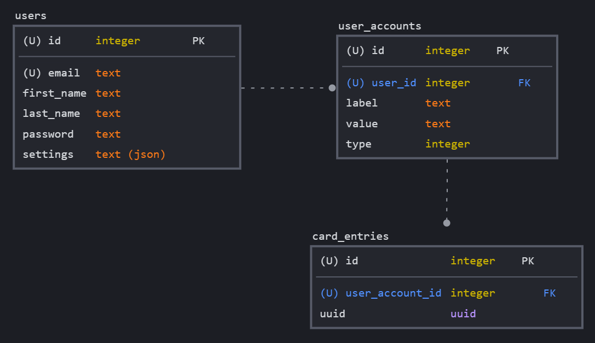

# The G.O.O.N. Card Project

The Goon Squad's Goon Card Project for CSC 355 ('22)

## -- Team Members --

- Payton shaltis
- Leah Kazenmayer
- Nisha Reddy
- Sterly Deracy
- Shane Matyi

## -- Tables of Contents --

1. [Setup](#---general-setup---)
2. [Development Process](#---development-process---)
3. [Accessibility](#---accessibility---)
4. [Features](#---features---)
5. [Use Cases](#---use-cases---)
6. [Concerns/Guidelines](#---concernsguidelines---)
7. [Routes](#---configured-routes---)

## -- Prettier Formatting --

The `.prettierrc` file stores the formatting rules for the project. It is used by the `prettier` package to format the code. You can format all code in the project by running `npm run format` after writing code in order to adjust whitespace, indentation, and blank lines between code. This should hopefully avoid commits that include mostly formatting changes.

Currently, Prettier doesn't support `.ejs`, but you can get around this by using the VSCode extension and setting your default formatter in VSCode to Prettier and adjust the `.ejs` association to `HTML` like in [this link](<https://stackoverflow.com/questions/59238175/visual-studio-code-isnt-recognising-ejs#:~:text=5-,Working%20solution,-(September%202021)>). The extension allows you to use the VSCode option to auto-format on save, which is definitely recommended.

## -- General Setup --

### Starting the Server

1. Make sure that you have downloaded all dependencies by running `npm install`.
2. Run `npm start` to start the server on its configured port.
3. You can access the server at `http://localhost:3000`, or on other computers on the same network if you know your local IP address.

### Local Database Setup

In order to run the app locally, the database also needs to exist in the project directory. In order to prevent the database from being committed to the repo, it is ignored by git. To create the database, run `npm run seed` in the main project directory. This will:

1. Delete the database file if it already exists.
2. Create a new database file.
3. Create the tables.
4. Seed the database with some sample data from `./seed.js`.

When testing the application locally, any data that you add will be deleted and the database reseeded with another run of `npm run seed`. This configuration is just for testing the application while we develop; once we start testing with other users, we can change the configuration to persist data.

### Database Schema

We are using an SQLite database in order to store users' preferred settings as well as their account information. Below is a diagram of the database's current schema.

- Because each user will have the same set of options, it makes more sense to store this as a JSON object within the `users` table and parse it later.
- Because each user will likely have a different number of social media accounts, it makes more sense to store these in a seperate table and link the two with a foreign key.
- The `card_entries` table will be used to keep track of which social media accounts are linked to which card. This will allow us to quickly and efficiently generate new Goon Cards without needing to create a new file for each card.

## -- Development Process --

We currently have 4 commands:

1. `npm run format` - Formats the application code usually the Prettier Formatting
2. `npm run seed` - Loads the database with default values
3. `npm start` - Starts up the server so that you can use the application, and runs `npm run format`
4. `npm run cleanStart` - Runs a combination of the first 3 commands in the order listed.

When you make a change (At least on the front-end side), you should just be able to refresh the page. Before you push the code to the repo to make a Pull Request, make sure to run `npm run format` to format the code so that it matches the repo's white space and indentation.

If you get a message about files being modified and changing from LF to CLF for example, do `git add -A` to fix the issue.

## -- Accessibility --

Below are some accessibility features and concerns that the application has.

## -- Features --

- Settings Page allows users to customize their display. For example, a user can modify their name, font-size, font-family, contrast, and theme. This functionality was implemented to let users with visual or other limitations to have a more user-friendly accessible application.
- The web application is responsive on both mobile versions and desktop versions for users with a wide variety of devices.
- We will implement a speech recognition feature where users can dictate a command into the device's microphone after selecting the microphone icon and have the action be carried out. This feature is to help users with physical impairments or restrictions.
- Visual displays such as icons or codes or potentially unrecognizable entities will have alt tags for users with screen readers to be able to identify.

## -- Use Cases --

- A user can register an account on this application
- A user can input, edit, and delete their social media information.
- A user can select which social media information to share and generate a QR code associated with their selections to share with others.

## -- Concerns/Guidelines --

- Check out [this link](https://www.smashingmagazine.com/2021/03/complete-guide-accessible-front-end-components/) for accessiblity guidelines to consider.

## -- Configured Routes --

### `home` Routes

- `GET /` - Loads the home page if logged in, otherwise redirects to the login page. The home page is passed the user object for displaying information about the user.
- `GET /home/style` - Serves the home page's stylesheet.
- `GET /home/main` - Serves the home page's JavaScript.

### `account/login` Routes

- `GET /account/login` - Loads the login page, passing it an error that can be optionally displayed.
- `POST /account/login` - Attempts to log the user in. If successful, redirects to the home page. If unsuccessful, redirects to the login page with an error message. Used in form submission.

### `account/logout` Routes

- `GET /account/logout` - Logs the user out and redirects to the login page. This is implemented as a GET method in order to use it in an `<a>` tag.

### `account/signup` Routes

- `GET /account/signup`- Loads the signup page, passing it an error that can be optinally displayed.
- `POST /account/signup` - Attempts to create a new user. If successful, redirects to the home page. If unsuccessful, redirects to the signup page with an error message. Used in form submission.

### `account/profile` Routes

- 'GET /account/profile/getsettings' - Returns the users selected settings

### `account/settings` Routes

### `account/aboutus` Routes

### `account/displaycard` Routes

### `account/notfound` Routes
