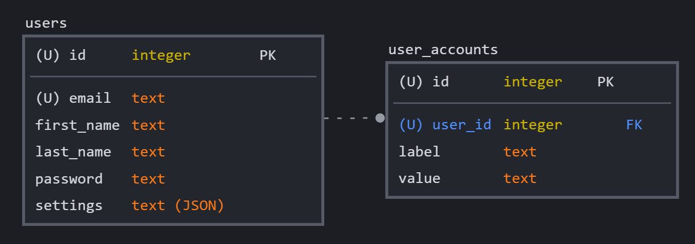

# The G.O.O.N. Card Project

The Goon Squad's Goon Card Project for CSC 355 ('22)

## -- Team Members --

- Payton shaltis
- Leah Kazenmayer
- Nisha Reddy
- Sterly Deracy
- Shane Matyi

## -- Prettier Formatting --

The `.prettierrc` file stores the formatting rules for the project. It is used by the `prettier` package to format the code. You can format all code in the project by running `npm run format` after writing code in order to adjust whitespace, indentation, and blank lines between code. This should hopefully avoid commits that include mostly formatting changes.

Currently, Prettier doesn't support `.ejs`, but you can get around this by using the VSCode extension and setting your default formatter in VSCode to Prettier and adjust the `.ejs` association to `HTML` like in [this link](<https://stackoverflow.com/questions/59238175/visual-studio-code-isnt-recognising-ejs#:~:text=5-,Working%20solution,-(September%202021)>). The extension allows you to use the VSCode option to auto-format on save, which is definitely recommended.

## -- Server --

Below are the instructions for running the backend server as well as an overview of the currently configured routes.

### Starting the Server

1. Make sure that you have downloaded all dependencies by running `npm install`.
2. Run `npm start` to start the server on its configured port.
3. You can access the server at `http://localhost:3000`, or on other computers on the same network if you know your local IP address.

### Development Process

When you make a change (At least on the front-end side), you should just be able to refresh the page. Before you push the code to the repo to make a Pull Request, make sure to run `npm run format` to format the code so that it matches the repo's white space and indentation.

If you get a message about files being modified and changing from LF to CLF for example, do `git add -A` to fix the issue.

### Configured Routes

#### `home` Routes

- `GET /` - Loads the home page if logged in, otherwise redirects to the login page. The home page is passed the user object for displaying information about the user.
- `GET /home/style` - Serves the home page's stylesheet.
- `GET /home/main` - Serves the home page's JavaScript.

#### `account/login` Routes

- `GET /account/login` - Loads the login page, passing it an error that can be optionally displayed.
- `POST /account/login` - Attempts to log the user in. If successful, redirects to the home page. If unsuccessful, redirects to the login page with an error message. Used in form submission.

#### `account/logout` Routes

- `GET /account/logout` - Logs the user out and redirects to the login page. This is implemented as a GET method in order to use it in an `<a>` tag.

#### `account/signup` Routes

- `GET /account/signup`- Loads the signup page, passing it an error that can be optinally displayed.
- `POST /account/signup` - Attempts to create a new user. If successful, redirects to the home page. If unsuccessful, redirects to the signup page with an error message. Used in form submission.

## -- Database --

We are using an SQLite database in order to store users' preferred settings as well as their account information. Below is a diagram of the database's schema.

- Because each user will have the same set of options, it makes more sense to store this as a JSON object within the `users` table and parse it later.
- Because each user will likely have a different number of social media accounts, it makes more sense to store these in a seperate table and link the two with a foreign key.
